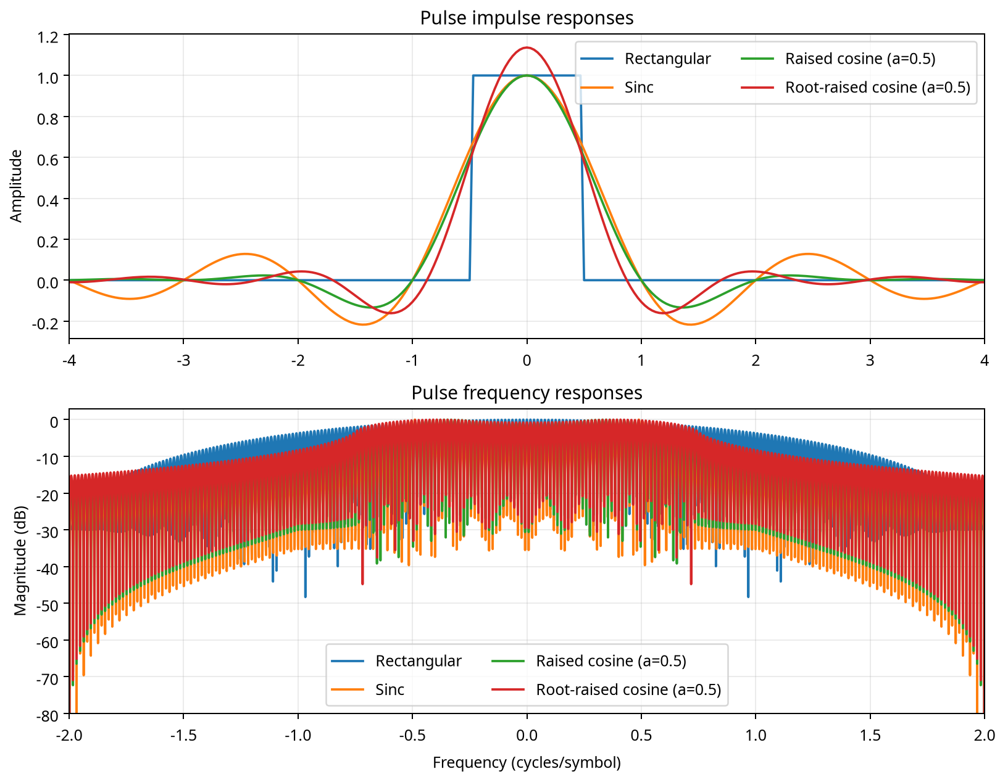
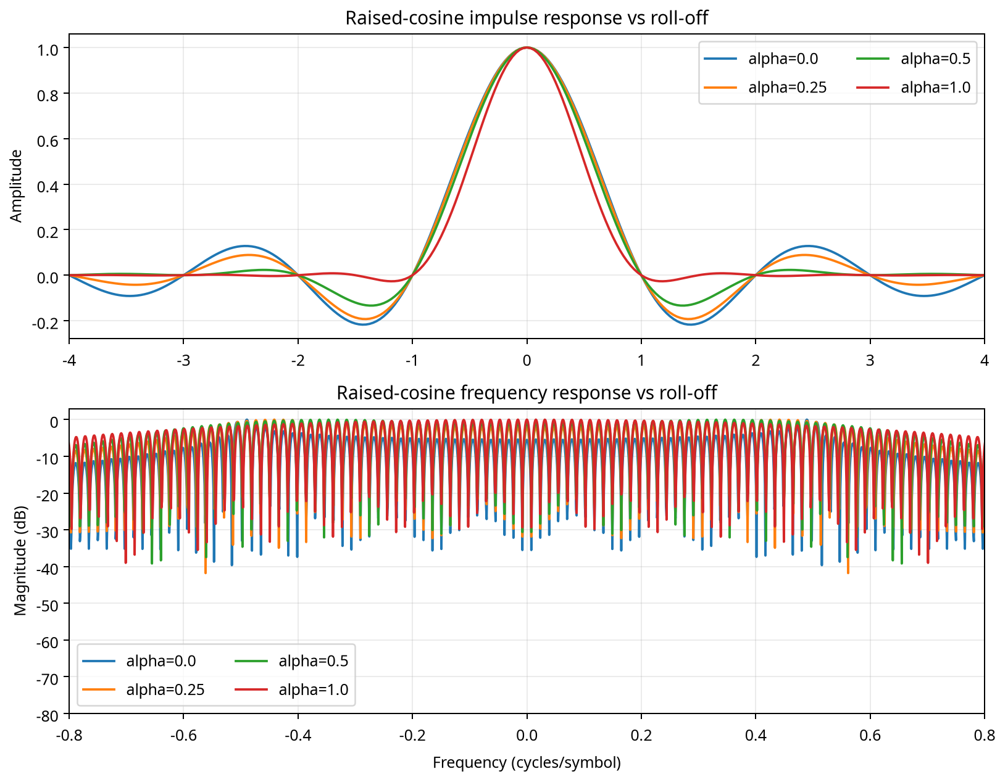
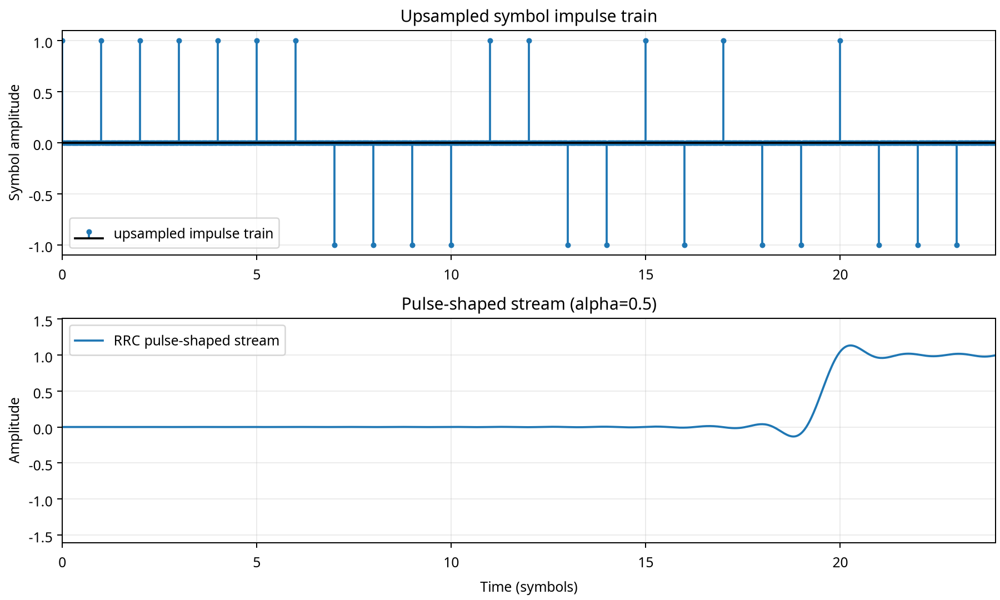
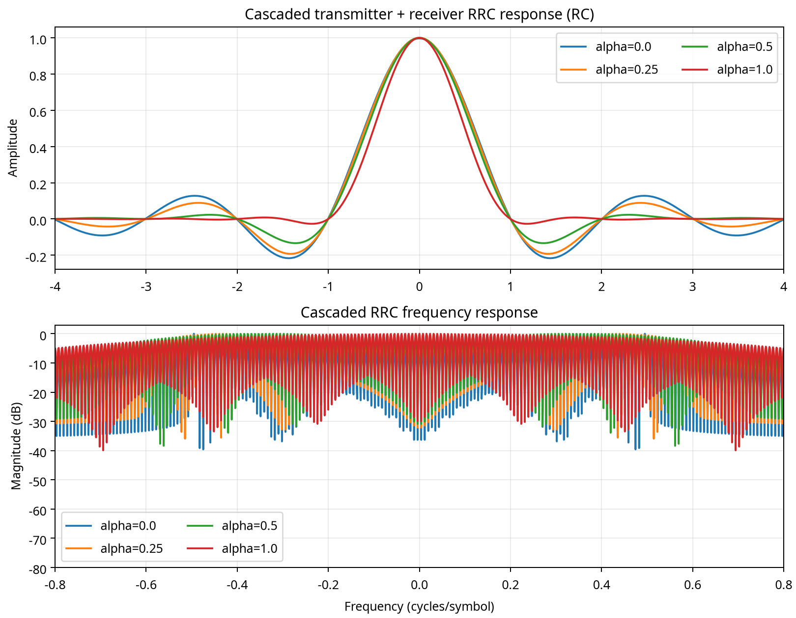
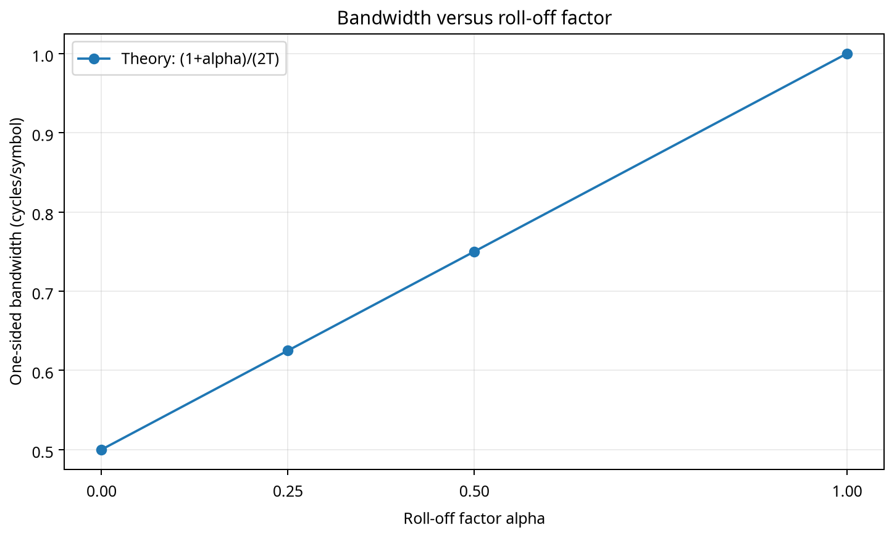

# Experiment 7 — Pulse Shaping and the Nyquist Criterion

## Conclusion

The simulation confirms the central bandwidth–timing trade-off of raised-cosine pulse shaping. Increasing the roll-off factor \(\alpha\) widens the occupied Nyquist bandwidth from \(1/(2T)\) at \(\alpha=0\) to \(1/T\) at \(\alpha=1\), while making the time-domain pulse decay faster. The transmitter and receiver root-raised-cosine (RRC) filters cascade to the raised-cosine (RC) response, and the sampled cascade is approximately one at the main symbol and zero at all other integer symbol intervals.

A finite-length implementation cannot reproduce the infinite-duration \(\alpha=0\) sinc pulse exactly. The diagnostic therefore uses a ±32-symbol truncation and reports the residual error explicitly. For \(\alpha=0.25, 0.5, 1\), the largest measured off-center integer-symbol sample is below \(1.3\times10^{-6}\), \(3.5\times10^{-7}\), and \(8.8\times10^{-8}\), respectively. The \(\alpha=0\) residual is \(3.5\times10^{-3}\); increasing the truncation span from ±8 to ±32 symbols reduced the error substantially, identifying truncation rather than a failure of the Nyquist construction.

## 1. Mathematical definitions

Time is normalized to one symbol period, \(T=1\), and the normalized sinc function is \(\operatorname{sinc}(x)=\sin(\pi x)/(\pi x)\). The raised-cosine pulse used in the simulation is

\[
h_{RC}(t)=\operatorname{sinc}(t/T)\,
\frac{\cos(\pi\alpha t/T)}{1-(2\alpha t/T)^2}.
\]

The removable singularities were handled explicitly. At \(\alpha=0\), the expression is evaluated as the sinc pulse. At \(t=\pm T/(2\alpha)\), the limiting value

\[
h_{RC}=\frac{\alpha}{2}\sin\left(\frac{\pi}{2\alpha}\right)
\]

is inserted directly.

The RRC pulse is

\[
h_{RRC}(t)=\frac{\sin[\pi(t/T)(1-\alpha)]+4\alpha(t/T)\cos[\pi(t/T)(1+\alpha)]}{\pi(t/T)[1-(4\alpha t/T)^2]}.
\]

At \(t=0\), the limiting value is \(1-\alpha+4\alpha/\pi\). At \(t=\pm T/(4\alpha)\), the corresponding removable-singularity limit is inserted explicitly in the code. These cases prevent division-by-zero numerical artifacts.

The theoretical one-sided Nyquist bandwidth is

\[
B=\frac{1+\alpha}{2T}.
\]

## 2. Simulation setup

The sampling rate is 32 samples per symbol. A symbol impulse train is produced by placing each bipolar symbol at every 32nd sample and setting all intervening samples to zero. A deterministic random seed is used for the 24-symbol demonstration stream so that the result is reproducible. The RRC pulse span is ±32 symbols for the zero-crossing validation. The cascaded response is computed as the discrete convolution of the transmitter and receiver RRC pulses multiplied by the sample interval \(1/32\).

The complete implementation is available in [`experiment7_pulse_shaping.py`](../experiment7_pulse_shaping.py).

## 3. Pulse comparison

The rectangular pulse has finite time support and a sinc-shaped spectrum. The sinc pulse has ideal Nyquist zero crossings but infinite time support. The RC pulse has controlled sidelobes and exact zero crossings at nonzero integer symbol periods. The RRC pulse is not itself the overall Nyquist response; it is intended to be paired with a matched RRC filter at the receiver.

The frequency-response panel uses a finite FFT of the truncated time-domain pulses. Consequently, the displayed spectra include sidelobe ripple and do not represent an ideal infinite-duration transform exactly. The qualitative comparison remains clear: rectangular time gating produces broad spectral sidelobes, whereas RC/RRC shaping controls the transition and decay.

## 4. Raised-cosine roll-off variations

### \(\alpha=0\): sinc limit

**Expected physical effect before simulation.** The pulse should have the smallest theoretical Nyquist bandwidth, \(B=0.5/T\), but the slowest time-domain decay. It should have exact zeros at all nonzero integer symbol periods in the infinite-duration limit.

**Observation and interpretation.** The pulse is sinc-like and has the narrowest ideal bandwidth. The finite ±32-symbol implementation gives a main sample of 0.9968 and a maximum off-center sample of \(3.51\times10^{-3}\). This small discrepancy agrees with the expected effect of truncating an infinite-duration sinc pulse. The test used to diagnose it was a span comparison: the earlier ±8-symbol window produced much larger off-center samples, while the ±32-symbol window reduced them to the values reported here.

### \(\alpha=0.25\)

**Expected physical effect before simulation.** The bandwidth should increase to \(0.625/T\), while the time-domain pulse should decay faster than the sinc limit and retain exact Nyquist zeros.

**Observation and interpretation.** The measured cascade has a main sample of 0.9999990 and a maximum off-center sample of \(1.25\times10^{-6}\). The pulse is more compact in time than the \(\alpha=0\) case. The result agrees with theory. The integer-symbol sample test verifies the zero crossings.

### \(\alpha=0.5\)

**Expected physical effect before simulation.** The bandwidth should be \(0.75/T\). The transition band should be wider and the time-domain sidelobes should decay more rapidly than for \(\alpha=0.25\).

**Observation and interpretation.** The main cascade sample is 0.9999997 and the maximum off-center sample is \(3.50\times10^{-7}\). The response is visibly more compact, and the frequency transition is wider. This agrees with the bandwidth–timing trade-off predicted by the RC definition.

### \(\alpha=1\)

**Expected physical effect before simulation.** The Nyquist bandwidth should reach \(1/T\), the largest tested value. The time response should have the fastest decay and the broadest frequency transition.

**Observation and interpretation.** The main cascade sample is 0.99999994 and the maximum off-center sample is \(8.74\times10^{-8}\). The pulse is the most compact of the four cases, while the frequency response occupies the widest Nyquist band. The result agrees with theory.

## 5. Upsampling and pulse-shaped stream

The upper panel shows the upsampled symbol impulse train. Each symbol is separated by 32 samples, so the impulse locations are one symbol period apart. Convolution with the \(\alpha=0.5\) RRC pulse produces the continuous-looking lower stream. Neighboring symbols overlap in time, but the matched-filter cascade restores the Nyquist sampling property at the decision instants.

## 6. Transmitter–receiver RRC cascade

The convolution of two matched RRC filters approximates the RC response because their frequency responses multiply to the RC spectrum. The cascade is therefore the response that should be sampled for the Nyquist test. Increasing \(\alpha\) broadens the transition region and shortens the time-domain tails. The bandwidth plot follows the linear law \(B=(1+\alpha)/(2T)\).

## 7. Mandatory Nyquist validation

The following table samples the overall RC response generated by the cascaded RRC filters at integer symbol intervals. The expected result is approximately 1 at \(k=0\) and 0 for every nonzero integer \(k\).

| \(\alpha\) | \(k=-6\) | \(k=-5\) | \(k=-4\) | \(k=-3\) | \(k=-2\) | \(k=-1\) | \(k=0\) | \(k=1\) | \(k=2\) | \(k=3\) | \(k=4\) | \(k=5\) | \(k=6\) |
|---:|---:|---:|---:|---:|---:|---:|---:|---:|---:|---:|---:|---:|---:|
| 0.00 | -3.506e-3 | 3.443e-3 | -3.382e-3 | 3.325e-3 | -3.269e-3 | 3.217e-3 | 0.996834 | 3.217e-3 | -3.269e-3 | 3.325e-3 | -3.382e-3 | 3.443e-3 | -3.506e-3 |
| 0.25 | 1.916e-8 | -9.470e-7 | 1.252e-6 | -8.300e-7 | -1.433e-8 | 7.709e-7 | 0.999999 | 7.709e-7 | -1.433e-8 | -8.300e-7 | 1.252e-6 | -9.470e-7 | 1.916e-8 |
| 0.50 | 3.496e-7 | 3.579e-9 | -3.134e-7 | -3.102e-9 | 2.830e-7 | 2.714e-9 | 1.000000 | 2.714e-9 | 2.830e-7 | -3.102e-9 | -3.134e-7 | 3.579e-9 | 3.496e-7 |
| 1.00 | -8.740e-8 | -8.269e-8 | -7.837e-8 | -7.440e-8 | -7.074e-8 | -6.736e-8 | 1.000000 | -6.736e-8 | -7.074e-8 | -7.440e-8 | -7.837e-8 | -8.269e-8 | -8.740e-8 |

The raw validation data are also available in [`nyquist_zero_crossings.csv`](nyquist_zero_crossings.csv). The bandwidth data are available in [`bandwidth_rolloff.csv`](bandwidth_rolloff.csv).

## 8. Files produced

| File | Purpose |
|---|---|
| `01_pulse_comparison.png` | Rectangular, sinc, RC, and RRC time/frequency comparison |
| `02_rc_rolloff.png` | RC impulse and frequency responses for all four roll-offs |
| `03_pulse_shaped_stream.png` | Upsampled impulse train and pulse-shaped stream |
| `04_rrc_cascade.png` | Cascaded RRC time/frequency responses |
| `05_bandwidth_vs_rolloff.png` | Theoretical bandwidth versus roll-off factor |
| `nyquist_zero_crossings.csv` | Mandatory integer-symbol validation table |
| `bandwidth_rolloff.csv` | Bandwidth and numerical diagnostic data |
| `experiment7_pulse_shaping.py` | Reproducible implementation |

## References

[1]: https://en.wikipedia.org/wiki/Raised-cosine_filter "Raised-cosine filter definition and Nyquist bandwidth"

[2]: https://en.wikipedia.org/wiki/Root-raised-cosine_filter "Root-raised-cosine filter definition"

[3]: https://www.analog.com/en/resources/technical-articles/raised-cosine-filter.html "Raised-cosine filtering and intersymbol interference"
